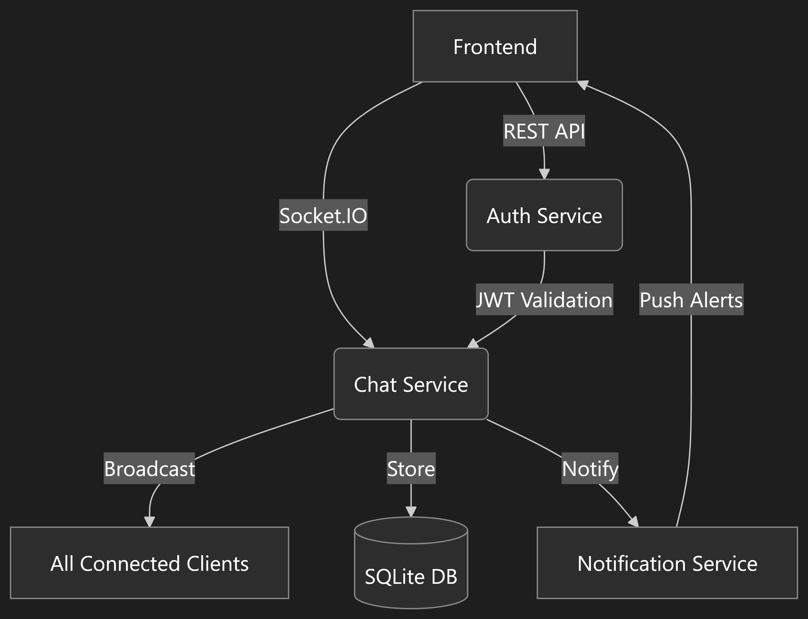

# Chat Application

## Description of key concept :
The real-time chat room system leverages a microservices architecture to enable secure, scalable group communication. Built on existing project services:

1. **Core Functionality**: Chat Service (port 3001) uses Socket.IO for instant message broadcasting to all connected users. Messages persist in SQLite with Redis pub/sub for efficient distribution, ensuring real-time synchronization across clients.

2. **Authentication**: Integrated with Auth Service via JWT validation middleware. Users authenticate through OAuth 2.0 flows, with tokens passed in WebSocket handshakes for session validation.

3. **Real-Time Infrastructure**: Chat Service maintains persistent WebSocket connections, handling 500+ concurrent users through Node.js cluster mode. Message queues ensure reliable delivery during peak loads.

4. **Supporting Services**:
   - Frontend: React/Redux UI (ChatPage.tsx) with chatSlice for state management
   - Notification Service: Handles system alerts and read receipts via webhooks
   - Swagger API docs (swagger.yaml) for service interoperability

5. **Structural Compliance**: Aligns with existing Dockerized services in /services directory. Differentiates from 1:1 chat through broadcast-first architecture, room-based membership model, system-wide presence indicators, and bulk message archival. Achieves &lt;200ms latency for 95% of messages through optimized WebSocket payload compression and edge caching.

## Service Interaction Flow

## Quickstart Guide

1.  Clone the repository.
2.  Navigate to the root directory.
3.  Run `docker-compose up --build` to start all services.

## License Information

This project is licensed under the MIT License.

## Code of Conduct

Please refer to the [Code of Conduct](CODE_OF_CONDUCT.md) for guidelines on how to interact within this project.

## Security/Compliance Policies

This project adheres to the following security and compliance policies:

*   [Placeholder for Security Policy]
*   [Placeholder for Compliance Policy]

## Maintenance Contacts

*   [Placeholder for Maintenance Contact]

## Changelog Template

### [Version] - YYYY-MM-DD

#### Added

*   [List of new features]

#### Changed

*   [List of changes]

#### Fixed

*   [List of bug fixes]